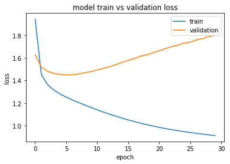
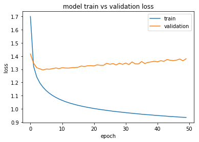

# Natural Language Processing OSS Final Report - Creating A Text Generator with Neural Network

Kai Levy and Jason Lan

#  Introduction

The goal of this OSS is to learn the basics of understanding complex language utterances with artificial intelligence. Throughout the OSS we learned to implement, train, debug, visualize and invent our own neural network models. By the end of the semester we gained a better understanding about Deep Learning and the cutting-edge research in natural language processing (NLP).

For our final project we created a text generator with a Long Short-Term Memory (LSTM) network. It’s a special type of recurrent neural network that is capable of learning long-term dependencies. Typically new information flows through the cells in the following 5 steps:

* Given the input xt and the previous hidden state h<sub>t-1</sub>, the network generates a new memory cell c<sub>t</sub> combining the new input and the previous memory:

<p align="center">
    
</p>

* Then the input gate determines whether the new information is useful based on the previous hidden state, generating the processed information as i<sub>t</sub>:
<p align="center">
    
</p>

* Meanwhile, the forget gate evaluates the usefulness of the past memory for computing the current memory:
<p align="center">
    
</p>
                                                  
* This step gather the output of input gate and forget gate. It forgets unnecessary past information and add into memory the new information to generate the final new memory c<sub>t</sub>:
<p align="center">
    
</p>
                                                          
* Finally the exposure gate assesses what parts of c<sub>t</sub> is worth exposing to the current hidden state h<sub>t</sub> and use for later evaluation:
<p align="center">
    
</p>                                                          

We started the project following the tutorial in a blog post and successfully implemented a text generator using the library Keras. Then we worked on validating the implementation, tuning the model to get optimal result, conducting experiments on the model and recreating the implementation in TensorFlow. 

# Implementation
## Validation implementation

We attempted to manually implement a categorical cross-entropy loss function on any given passage, so that we could evaluate the models’ performance with any text that we chose to supply. However, our manual implementation, which was supposed to iterate character by character through a passage, did not work out cleanly. Instead, we found two alternative ways to use the parallel processing power of tensorflow and the useful api of keras to evaluate the predictions quickly and cleanly, using either `model.evaluate()` or the function in `RNN_utils.py`, `evaluate_loss()`.

## Other modifications to Tran’s text generator

We made a few other modifications to the code that we adopted from the blog post about text generations. Notably, we tweaked the text generation method in two ways: first, so that we could have more control, and tell the predictor which characters to start a sequence with, so that we could compare generated text more easily; and second, we implemented a “random” mode for the text generation, which chose the next character in the prediction sequence by rolling a random number generator and selecting the one appropriate to the probabilities, as opposed to simply choosing the next character with the highest probability. 

We developed a few additional helper functions that allowed us to run experiments more carefully in jupyter notebooks, but these two additions (as well as the loss evaluation above) were the most interesting features that we added


## Tensorflow implementation

We also tried to recreate the text generator with TensorFlow following the format of Stanford CS224’s framework(Appendix) we’ve been using in the problem sets. It encapsulates TensorFlow computational graphs and works as a scaffold for model implementation. However we didn’t manage to make the model function as expected in the end. The main purpose of the re-implementation is for better understanding the text generating model. We achieved a good amount of the learning goal here during the process of rewriting the model as well as debugging throughout the way. As the model was not functioning as expected in the end and we decided to pivot to fine-tuning the existed model to achieve optimal performance, we decided to set the implementation as stretch goal. 

# Experiments

To find an optimal model for the text generator, we attempted to tune the parameters of input dropout, number of layers and hidden state size. For each of the parameter we conducted experiments with three different values. Due to time constraint and concern for overfitting with running too many epochs, we scripted the training process to terminate if the training or validation loss increased by at least 0.001 for two consecutive epochs. The keras api made it very easy to implement this early stopping feature. 


We ran our experiments on the dataset of Shakespeare’s complete works. Before beginning training, we split off the last 20% of the data as testing data, which would be used to compare different model parameters against each other. With the rest of the 80%, we split off another 20% as validation data, which would be used to evaluate the model between each epoch and prevent overfitting. This left 64% of the original data to be trained on.


The setup and process of running these experiments is contained in the jupyter notebook, `experimental_setup`. Our default parameters were 2 layers, 500 hidden size, and 0 dropout. The varied parameters were 1 or 3 layers, 300 or 700 hidden size, and 0.15 or 0.3 dropout. For each variance in the models, the other parameters were set to default. This led to 7 different model configurations that were tested. Given more, time, we would have liked to test even more parameters, but fitting these 7 models took over 12 hours of training on GPUs as it was.

# Results

Below is a table which outlines the model parameters and the associated losses, as well as the number of epochs before each termination. The model parameters that achieved the best validation and loss results were the default parameters, with an input dropout rate of 0.15. This model also trained for a bit longer than most, likely because the dropout would randomly block the inputs of the LSTM cells, and change the input data slightly. This would help prevent overfitting. 

| NUM_LAYERS | HIDDEN_SIZE | DROPOUT | EPOCHS_UNTIL_STOP | TRAIN_LOSS  | VAL_LOSS    | TEST_LOSS   | GENERATION START WITH H                                                                                     | RANDOM GENERATION START WITH H                                                                               |
|------------|-------------|---------|-------------------|-------------|-------------|-------------|-------------------------------------------------------------------------------------------------------------|--------------------------------------------------------------------------------------------------------------|
| 2          | 500         | 0       | 6                 | 1.244195583 | 1.569097664 | 1.496347123 | "He that hath been a stranger than the state\nTo the poor man's advantage of the parties of the part\nTh",  | "Henobed my daughter gaze\nThat you have cased to the advantage of my friend.\n\nHESTYRY:\n'Twould have di", |
| 2          | 300         | 0       | 10                | 1.251943684 | 1.588350558 | 1.515685592 | Here is a man of my consent,\nAnd the duke of the sea and the state of her state,\nAnd the duke of the ',   | He says my lord, adieu,\nMethinks this word within these hours,\nThat on the print is threatening ever,',    |
| 2          | 700         | 0       | 7                 | 1.157424722 | 1.580256926 | 1.518067578 | Here is a strange that she shall be so fairly.\n\nBRUTUS:\nI do not see the marketh of the state,\nAnd th', | "HENRY VIII:\nI have no more mad-certaintral grace\nWhere he was liin from him, and take't with shelt ou",   |
| 1          | 500         | 0       | 9                 | 1.269425737 | 1.602660915 | 1.540348268 | "Here is the storm of the state of the state\nThat should have stol'n his state and strange state\nAnd s",  | "H:\nHow say you, will you you break the open to a slave?\n'Tis true: which shall be hedged of men!\nShal",  |
| 3          | 500         | 0       | 7                 | 1.211703133 | 1.56380765  | 1.5112775   | Here is a prince and the state of the state\nAnd there were so much to the common prince and the state',    | HERSITES:\nHe was whom I think they would lie.\n\nBRUTUS:\nAdventurally, aleward, from title honour\nThat ', |
| 2          | 500         | 0.15    | 10                | 1.283776842 | *1.549497075* | *1.482365988* | Here comes the last that should be so with me?\n\nBEATRICE:\nI will not speak with me; I will not speak ',  | "Hath made me banished?\n\nOCTAVIUS:\nAn thou shalt lie, which we were slow,\nThere's near in thy pursuit.", |
| 2          | 500         | 0.3     | 13                | 1.328427298 | 1.554716093 | 1.4895319   | He is a dream of many a man as the sea,\nThat thou art the sea of the sea, and the sea of the sea,\nAnd']   | "HARNERICK:\nWhat wouldst thou? why set thou?\n\nPost:\nIt is true, what's the proud man? further! passion"  |


We were somewhat surprised to see that most of the models terminated very early (before 10 epochs), and they all terminated before 15. We deduced that they generally terminated because the validation loss would go up, meaning that the models were beginning to overfit. This image of training loss and validation over time demonstrates the overfitting trend that started to creep into our models, over 30 epochs.




However, we still felt that the models that were trained for longer would qualitatively produce better passages than those that had terminated early because of overfitting. For example, one of the models that terminated early with a test loss of about 1.51 generated the phrase: 
```
Here is the storm of the state of the state 
That should have stol'n his state and strange state 
And
```
. This doesn't really make sense, and it overuses the word "state" a ton. By contrast, after training the model for 50 epochs, it achieved a validation loss of 1.64, which is slightly higher, but had a better generated phrase: 

```
Here is a man that had a heart
To take a brothel of the world.

CORNWALL:
What say you?

CASSIUS:
I 
```

This is possibly because the lowest entropy of the character by character passages is around 1.5, and these slight differences don't mean that much. But rather, the longer that the model trains, the more natural it will sound. An additional passage form the 50 epoch, with random on:
```
HELENA:
That I do famn us for my love: I would proceed.

KING RICHARD II:
And, mischief, good I longe. To her I do not,
Yea, Dolpoter of Secentaoner, 
```

The passages don't make a lot of sense, but they at least sound like Shakespeare.

Just for fun, we trained the "best" model parameters for 50 epochs on a lyrics database, which contained the top 100 billboard songs from 1964-2015.  It's loss looks similar, where the validation hits its minimum before 10, in the image below:



And it produced some fun, generally nonsensical passages (note: there was no capitilization or punctuation in this dataset)

```
its summer night im gonna show you how it feels to be loved be loved by you yes it is so care always
```

```
in the back of my mind i cant get you off my mind i cant get you off my mind i cant get you off my m
```
^That one could be achorus...


# Reflection

We’ve learned a number of lessons through the project. The first is never underestimating the time for tuning / training model. This is the first project we did about deep learning and it took us until the middle of the project to realize that each training iteration takes a significant amount of time. As a result, every step in the project took more than we expected and we had to cut down the number of experiments we’re trying in the end. If we were to do the project again, we would better scope the time and structure the workflow of training model, and made sure to allot proper time early on to let our model train.

The other thing we could’ve done better is to better formulate the problem before diving straight into implementation. We both liked the idea of text generator but didn’t scope out what are we going to achieve with the model. As a result we spent a lot of time learning the implementation and tuning the model but didn’t have the time to analyse or do further work with the result. We would have additionally liked to spend more time trying out different data sets, but found ourselves crunched for time in the end, especially with the long amount of time spent training.
